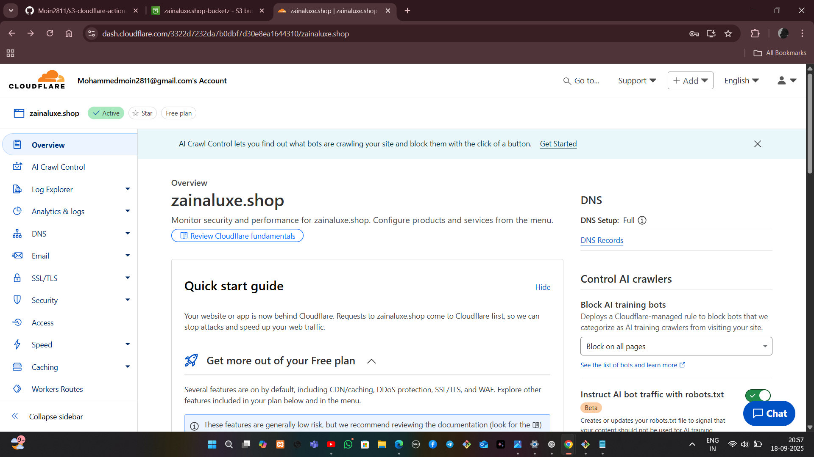
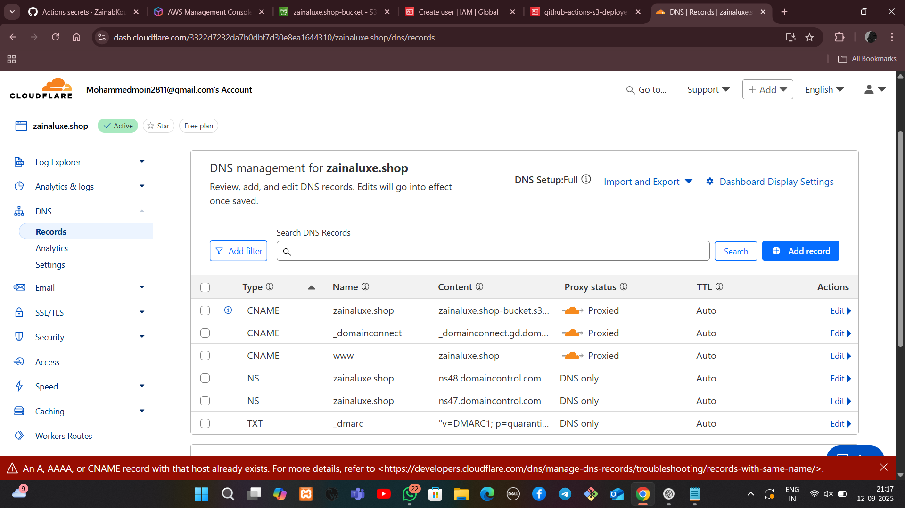
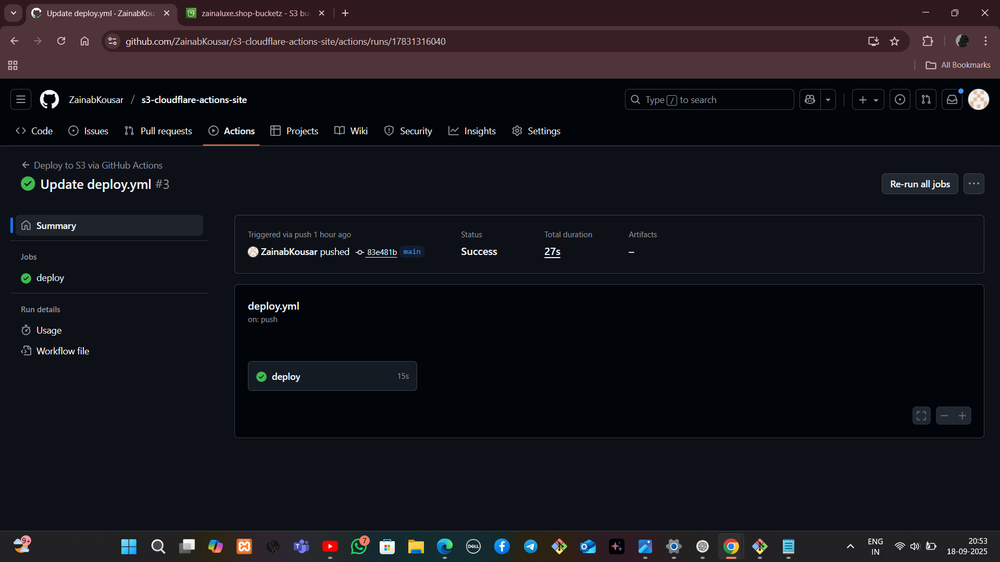
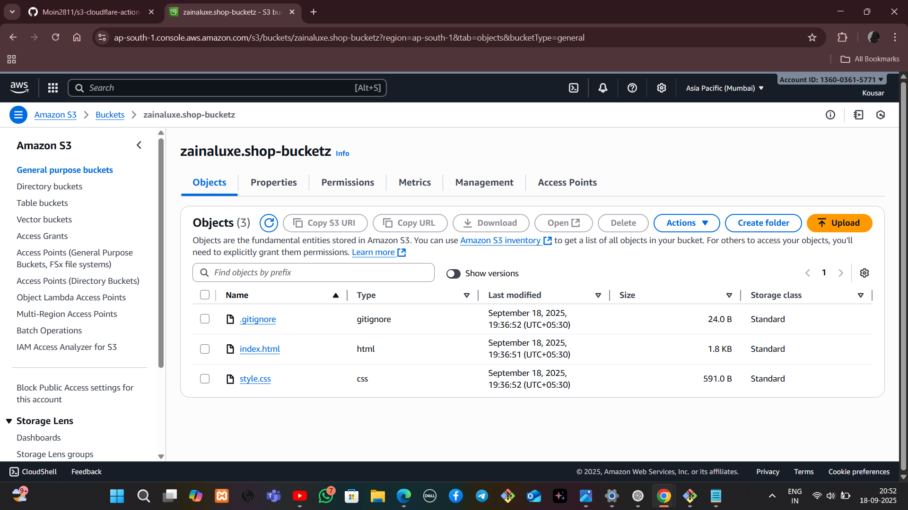

# Scalable Static Website with S3, Cloudflare & GitHub Actions

## 📌 Project Overview
This project demonstrates a fully automated workflow for hosting and deploying a static website. It integrates:

- **AWS S3** → Static website storage and hosting  
- **Cloudflare** → DNS, CDN, caching, and free SSL/TLS  
- **GitHub Actions** → CI/CD pipeline for automatic deployments  

Every time code is pushed to GitHub, the website is updated on S3, and Cloudflare cache is purged, ensuring real-time global updates.

---

## 🛠️ Tools & Technologies
- **AWS S3 (Free Tier):** Website hosting  
- **Cloudflare (Free):** DNS, CDN, HTTPS, caching, performance tuning  
- **GitHub Actions:** CI/CD automation  
- **HTML & CSS:** Static web content  
- **Bash & AWS CLI:** S3 policies and configuration  

---

## 🔑 Implementation Steps

### 1. Repository Setup
- Initialized a GitHub repository with `index.html` and `style.css`.  
- Registered a domain and connected it to Cloudflare.  

### 2. S3 Hosting
- Created an S3 bucket (same name as domain).  
- Enabled static website hosting.  
- Configured a bucket policy for public read access.  

### 3. IAM & GitHub Secrets
- Created an IAM user with restricted S3 permissions.  
- Added the following secrets to GitHub:
  - `AWS_ACCESS_KEY_ID`
  - `AWS_SECRET_ACCESS_KEY`
  - `S3_BUCKET_NAME`
  - `CLOUDFLARE_API_TOKEN`
  - `CLOUDFLARE_ZONE_ID`

### 4. GitHub Actions Workflow
Configured `.github/workflows/deploy.yml` to:
- Checkout source code  
- Configure AWS credentials  
- Sync files to S3  
- Purge Cloudflare cache  

### 5. Cloudflare Setup
- Configured DNS with CNAME → S3 endpoint  
- Enabled SSL/TLS Flexible mode  
- Turned on Auto Minify (HTML/CSS/JS) and Brotli compression  
- Applied caching rules for static assets  

### 6. Testing & Verification
- Made changes to `index.html`, committed & pushed.  
- GitHub Actions deployed updates to S3.  
- Site refreshed instantly at [https://zainaluxe.shop](https://zainaluxe.shop)

---

## ✅ Deliverables
- Live website hosted via Cloudflare CDN with HTTPS  
- Automated CI/CD deployment pipeline using GitHub Actions  
- Optimized performance with global caching and compression  

---

## 📷 Sample Screenshots

  
  
  
  
  
  
  

---

## 📖 Conclusion
This project delivers a scalable, secure, and cost-efficient static hosting solution using **AWS S3 + Cloudflare + GitHub Actions**. It removes manual deployment steps, provides instant global updates, and ensures performance optimization with CDN caching and HTTPS encryption.
